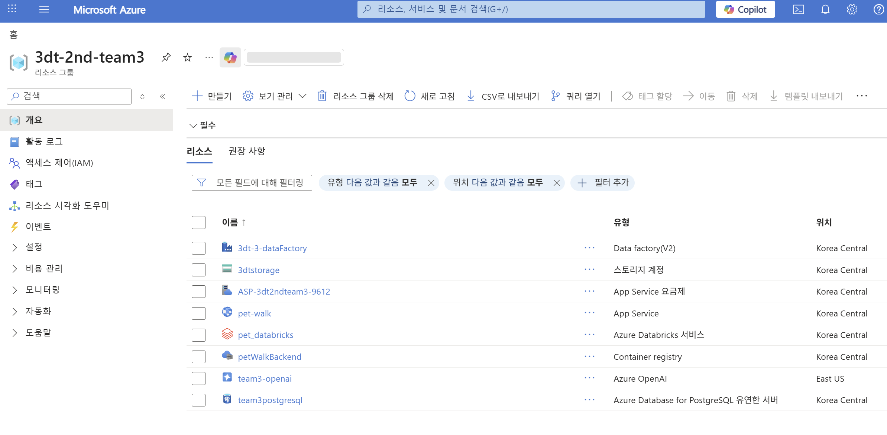
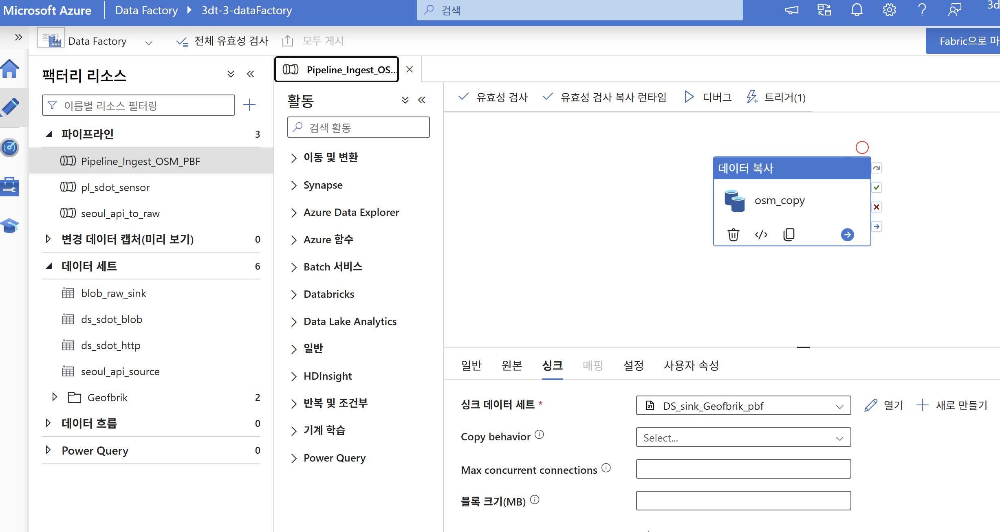
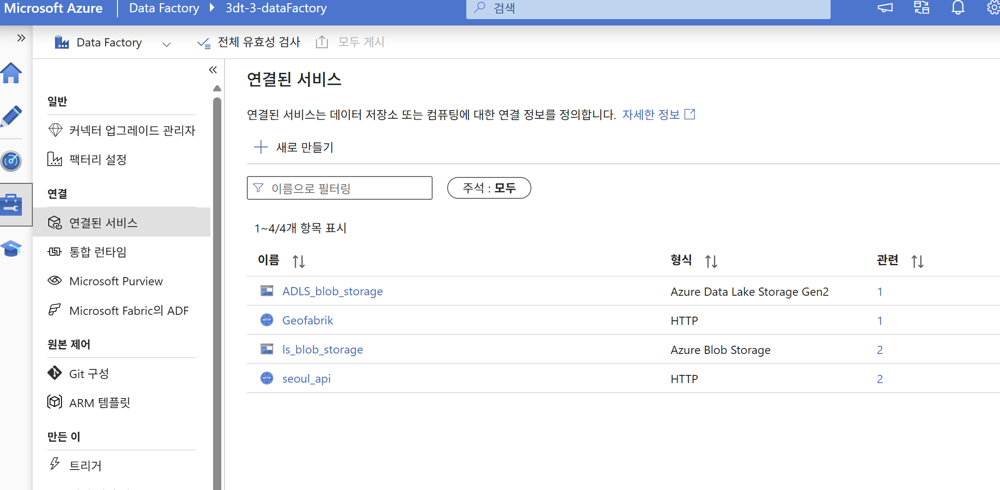
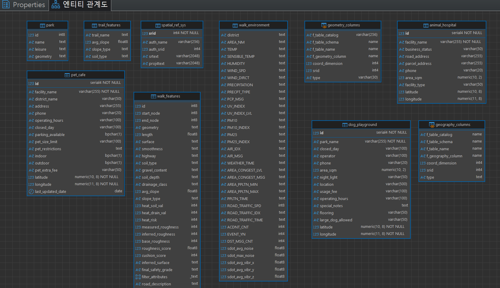
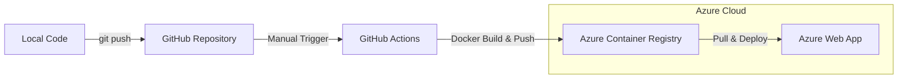

[🇰🇷 한국어](./README.md) | [🇺🇸 English](./README_EN.md)

# 🐾 Pet-Walk: 반려동물 산책로 위험도 분석 및 추천 시스템

반려동물과 안전한 안전한 산책을 즐길 수 있도록, **지형 정보(경사도·바닥 재질), 실시간 기상 데이터, 인근 시설 정보**를 종합 분석하여 최적의 산책로를 추천하는 백엔드 시스템입니다.

---

## 🏗 전체 시스템 아키텍처



| 구분 | 서비스 | 역할 |
|------|--------|------|
| 데이터 수집 | Azure Data Factory | OSM, 서울 API, S-DoT 자동 수집 |
| 데이터 처리 | Azure Databricks (Apache Sedona) | 공간 조인 및 지표 산출 |
| 데이터 저장 | Azure Blob Storage (raw / silver / gold) | 계층형 데이터 레이크 |
| DB | Azure Database for PostgreSQL (PostGIS) | 공간 데이터 적재 및 서빙 |
| 백엔드 | FastAPI + Azure Web App | API 서버 (컨테이너 배포) |
| AI | Azure OpenAI (GPT-4o / GPT-4o-mini) | 산책로 추천 자연어 응답 |

---

## 🛠 데이터 파이프라인

### 1. 데이터 수집 (Azure Data Factory)

Azure Data Factory를 활용하여 4개 소스에서 공공 데이터를 자동 수집합니다.




- **OSM (Geofabrik)**: 도로 중심선 및 보행로 네트워크 (PBF 포맷)_2개월 주기로 업데이트됨
- **서울 열린데이터 광장 API**: 실시간 날씨·혼잡도·도로소통·이벤트 정보
- **S-DoT**: 산책로 인근 실시간 소음·진동 데이터

### 2. 데이터 처리 (Azure Databricks)

Azure Databricks에서 두 개의 독립적인 파이프라인을 운영합니다.

#### 📍 지형 파이프라인 (edges)

OSM 도로 네트워크와 V-World 지형 데이터를 공간 조인하여 도로별 산책 지표를 산출합니다. Apache Sedona를 활용해 13만 개 이상의 도로 데이터에 대해 공간 조인(Spatial Join)을 수행합니다.

- **열 위험도**: 기온·복사열·토양 흡열 특성 기반
- **거칠기 점수**: 바닥 재질·자갈 함량 기반
- **쿠션 지수**: 토양 깊이·배수 등급 기반

실행 순서: `bronze_raw.ipynb` → `silver_large_scale.ipynb` / `silver_small_scale.ipynb` → `gold__scored.ipynb`

Sedona 설치 후 `%restart_python` 필수. 상세 내용은 [Databricks 파이프라인 가이드](./databricks/README.md) 참고.

#### 🌤 실시간 환경 파이프라인 (seoul_api)

서울 도시데이터 API와 S-DoT 센서 데이터를 수집해 장소별 실시간 보행 환경 지표를 만듭니다. 장소명(AREA_NM) 기준으로 날씨·혼잡도·도로소통·이벤트를 조인하고, 자치구 단위로 집계한 S-DoT 소음·진동 데이터를 붙입니다.

- **날씨**: 기온, 체감온도, 미세먼지, 자외선 등
- **혼잡도**: 실시간 유동인구 수준 및 혼잡 메시지
- **소음·진동**: S-DoT 센서 기반 구 단위 평균값

실행 순서: `storage_mount.ipynb` → `silver_citydata.ipynb` / `silver_sdot.ipynb` → `gold_sdot_join.ipynb`

### 3. 데이터 저장 (계층형 레이크)

Azure Blob Storage를 Raw → Silver → Gold 계층으로 구성하여 데이터 품질을 단계적으로 관리합니다.

### 4. 데이터베이스 설계 (PostgreSQL + PostGIS)



서비스 확장을 고려하여 산책로 특성(`walk_features`)과 환경 정보(`walk_environment`)를 분리 설계하였으며, PostGIS를 활용해 `LINESTRING` 공간 데이터를 서울시 좌표계에 정확히 매핑했습니다.

---

## 🚀 백엔드 서비스

### 시스템 배포 흐름



비용 최적화를 위해 **수동 배포(Workflow Dispatch)** 방식을 채택했습니다.

### 폴더 구조

```text
SecondProjectTeam3/
├── .github/workflows/    # CI/CD 워크플로 (Azure 배포)
├── backend/
│   └── app/
│       ├── api/          # API 엔드포인트 (추천, 지도, 안전 정보)
│       ├── core/         # 환경 설정
│       ├── models/       # Pydantic 데이터 모델
│       ├── services/     # 비즈니스 로직 (경사도 계산, 경로 탐색 등)
│       └── main.py
├── databricks/
│   ├── edges/            # 지형 파이프라인 (OSM + V-World)
│   │   ├── bronze_raw.ipynb
│   │   ├── silver_large_scale.ipynb
│   │   ├── silver_small_scale.ipynb
│   │   └── gold__scored.ipynb
│   ├── seoul_api/        # 실시간 환경 파이프라인 (서울 API + S-DoT)
│   │   ├── storage_mount.ipynb
│   │   ├── silver_citydata.ipynb
│   │   ├── silver_sdot.ipynb
│   │   └── gold_sdot_join.ipynb
│   └── postgres/         # PostgreSQL 적재
│       └── postgres_load_realtime.ipynb
├── data/                 # 공간 정보 데이터셋 (SHP, GPX, GeoJSON)
├── frontend/             # React Native 모바일 앱
├── image/                # README 이미지
├── docs/                 # 프로젝트 문서
├── Dockerfile
└── requirements.txt
```

### 로컬 실행

```bash
pip install -r requirements.txt
cd backend
uvicorn app.main:app --reload
# API 문서: http://127.0.0.1:8000/docs
```

---

## 🔗 관련 문서

| 문서 | 설명 |
|------|------|
| [데이터 정의서](./docs/data_dictionary.md) | 수집 및 가공 데이터의 컬럼/타입 정의 |
| [점수 산출 기준서](./docs/scoring_logic.md) | 열 위험도·거칠기·쿠션 점수 알고리즘 상세 |
| [백엔드 가이드](./docs/backend_guide.md) | 백엔드 구동 및 기능 안내 |
| [프론트엔드 가이드](./docs/frontend_guide.md) | 프론트엔드 구동 및 화면 안내 |
| [API 명세서](./docs/api_documentation.md) | API 엔드포인트 상세 명세 |
| [Azure 배포 가이드](./docs/azure_developer_guide.md) | Azure 배포, CI/CD 구성 및 과금 관리 |
| [Small Scale 개발 가이드](./docs/small_scale_dev_guide.md) | 루프 경로 기능 폴더 구조 및 임포트 경로 안내 |

---

## 📦 기술 스택


