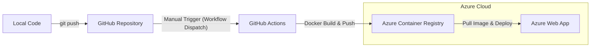

# Pet-Walk: 반려동물 산책로 추천 시스템 🐾

반려동물과 함께 쾌적하고 안전한 산책을 즐길 수 있도록 지형 정보(경사도, 바닥 재질), 실시간 기상 상태, 인근 시설 정보를 종합하여 최적의 산책로를 추천하는 서비스의 백엔드 시스템입니다.

---

## 🏗 시스템 아키텍처 및 연결 파이프라인

본 프로젝트는 GitHub, Azure Container Registry(ACR), Azure Web App을 연결하는 배포 파이프라인을 구축하였습니다. 비용 최적화 및 안정적인 운영을 위해 **수동 배포 방식**을 채택하고 있습니다.



---

## 📂 폴더 구조 설명

```text
SecondProjectTeam3/
├── .github/workflows/    # CI/CD 워크플로 설정 (Azure 배포)
├── backend/              # FastAPI 백엔드 어플리케이션 소스 코드
│   ├── app/
│   │   ├── api/          # API 엔드포인트 및 라우팅 (추천, 지도, 안전 정보)
│   │   ├── core/         # 환경 설정 (config.py, 보안 설정)
│   │   ├── models/       # 데이터 검증을 위한 Pydantic 모델
│   │   ├── services/     # 비즈니스 로직 (경사도 계산, 경로 탐색, 기상 정보 등)
│   │   └── main.py       # FastAPI 어플리케이션 실행 엔트리 포인트
│   └── .env              # 환경 변수 관리 (API 키, DB 접속 정보 등)
├── data/                 # 공간 정보 데이터셋 (SHP, GPX, GeoJSON)
├── Dockerfile            # 컨테이너 빌드를 위한 설정 파일
├── requirements.txt      # 프로젝트 의존성 라이브러리 목록
└── .dockerignore         # Docker 이미지 빌드 시 제외할 파일 목록
```

---

## 🚀 구동 방법 (Local)

### 1. 환경 설정
프로젝트 루트 폴더 혹은 `backend/` 폴더에서 가상환경을 생성하고 의존성을 설치합니다.

```bash
pip install -r requirements.txt
```

### 2. 서버 실행
FastAPI 서버를 실행합니다. (`backend` 폴더에서 실행 권장)

```bash
cd backend
uvicorn app.main:app --reload
```
*   API 문서 확인: `http://127.0.0.1:8000/docs`

---

## 🛠 GitHub Actions 적용 방법 (수동 배포)

현재 워크플로는 푸시할 때마다 자동 실행되지 않도록 설정되어 있습니다. 배포가 필요할 때만 아래 순서대로 진행하세요.

1.  **GitHub 저장소** 접속 -> **Actions** 탭 클릭
2.  `Build and deploy Python app to Azure Web App - pet-walk` 선택
3.  **Run workflow** 드롭다운 클릭 -> **Run workflow** 버튼 클릭
4.  빌드 및 배포가 완료될 때까지 대기 (약 3~5분 소요)

---

## 💡 Azure App Service 비용 관리 가이드

Azure 비용을 전략적으로 관리하기 위해 다음 프로세스를 권장합니다.

### 📉 미사용 시 (Scale-down)
*   **작업:** 개발이나 테스트를 진행하지 않을 때는 Azure Portal에서 서비스 계층을 **F1 (Free)** 티어로 변경합니다.
*   **효과:** 비용이 발생하지 않습니다.

### 📈 테스트 및 배포 시 (Scale-up)
1.  **스케일 업:** 테스트 전, 서비스 계층을 **B1** 또는 그 이상의 유료 티어로 올립니다.
2.  **워크플로 실행:** 배포 버튼을 눌러 최신 이미지를 반영합니다.
3.  **테스트:** Web App URL을 통해 기능을 확인합니다.

> [!CAUTION]
> F1 티어에서는 컨테이너 배포 및 구동이 제한되거나 성능이 매우 낮을 수 있으므로, **GitHub Actions를 실행하기 전에 반드시 스케일 업**을 먼저 진행해 주세요.

---

## 🔗 관련 문서
*   [Azure 개발 가이드](./Azure_developer_guide.md)
*   [Small Scale 개발 가이드](./small_scale_dev_guide.md)