[🇰🇷 한국어](./README_KO.md) | [🇺🇸 English](./README_EN.md)

# 🐾 Pet-Walk: 반려동물 산책로 위험도 분석 및 경로 추천 시스템

OSM · V-World · 서울 API · S-DoT 공공 데이터를 Azure Data Factory로 자동 수집하고,  
Apache Sedona(Databricks)로 13만 건 이상의 공간 조인을 처리하는 Azure 기반 지형 데이터 파이프라인 시스템입니다.

---

## 📌 프로젝트 개요

**Pet-Walk**는 반려동물과 함께 안전한 산책을 즐길 수 있도록, 지형 정보(경사도·바닥 재질), 실시간 기상 데이터, 인근 시설 정보를 종합 분석하여 최적의 산책로를 추천하는 백엔드 시스템입니다.

두 가지 시나리오로 경로를 추천합니다.

- **LargeScale**: 큰 공원 위주 장거리 경로 탐색 — 반려견 특성과 실시간 환경 데이터를 반영한 산책로·공원 추천
- **SmallScale**: 반려견 프로필(크기·나이·건강 특성) 기반 AI 루프 경로 추천 — GPT-4o-mini로 맞춤 경로 설명 생성

| 항목 | 내용 |
|------|------|
| 백엔드 | FastAPI + Azure App Service (Docker 컨테이너 배포) |
| 데이터 파이프라인 | Azure Data Factory → Azure Blob Storage (Medallion) → Azure Databricks |
| 데이터베이스 | Azure Database for PostgreSQL + PostGIS |
| AI | Azure OpenAI (GPT-4o · GPT-4o-mini) |
| 클라이언트 | React Native 모바일 앱 · 웹 대시보드 |

---

## 🏗 전체 시스템 아키텍처

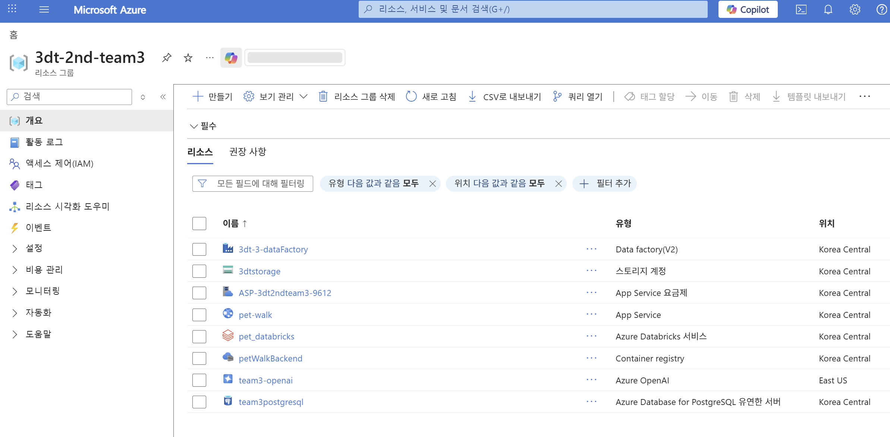

| 구분 | 서비스 | 역할 |
|------|--------|------|
| 데이터 수집 | Azure Data Factory | OSM · S-DoT · 서울 API 자동 수집 |
| 중간 저장 | Azure Blob Storage (raw / silver / gold) | Medallion 계층형 데이터 레이크 |
| 데이터 처리 | Azure Databricks (Apache Sedona) | 공간 조인 및 지표 산출 |
| 데이터베이스 | Azure Database for PostgreSQL + PostGIS | 공간 데이터 적재 및 서빙 |
| 백엔드 | FastAPI + Azure App Service | API 서버 (Docker 컨테이너 배포) |
| AI | Azure OpenAI (GPT-4o · GPT-4o-mini) | 경로 추천 자연어 응답 |

---

## 🛠 데이터 파이프라인

### 1. 데이터 수집 (Azure Data Factory)

**파이프라인 구성**

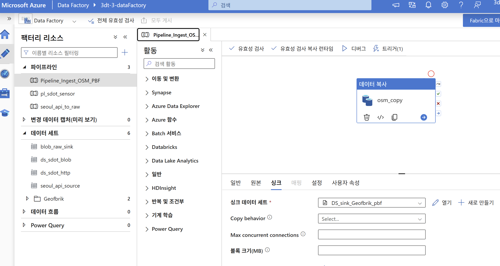

- `Pipeline_Ingest_OSM_PBF` — Geofabrik에서 OSM PBF 파일 수집 → Blob Storage 적재
- `pl_sdot_sensor` — S-DoT 센서 데이터 수집
- `seoul_api_to_raw` — 서울 열린데이터 광장 API 수집

**연결 서비스**

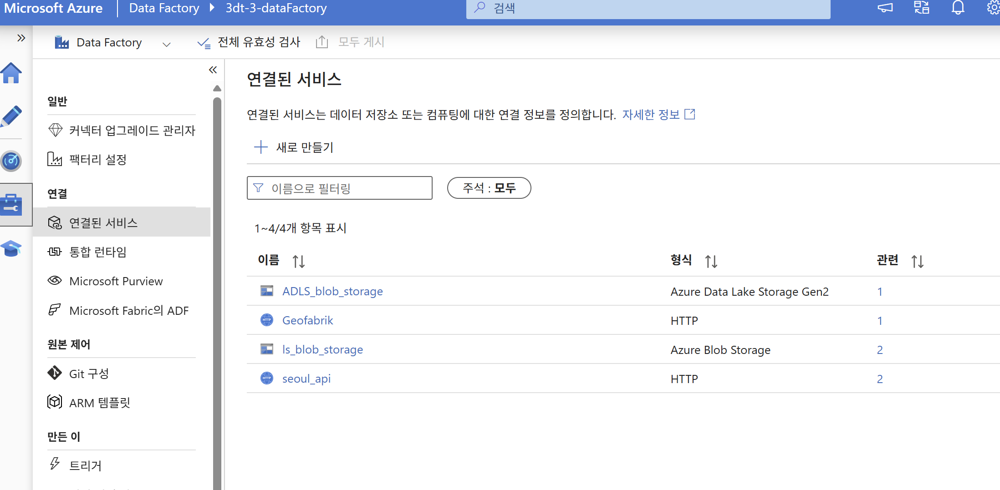

- `ADLS_blob_storage` — Azure Data Lake Storage Gen2
- `Geofabrik` — OSM PBF HTTP 소스
- `ls_blob_storage` — Azure Blob Storage
- `seoul_api` — 서울 공공 API HTTP 소스

**트리거**

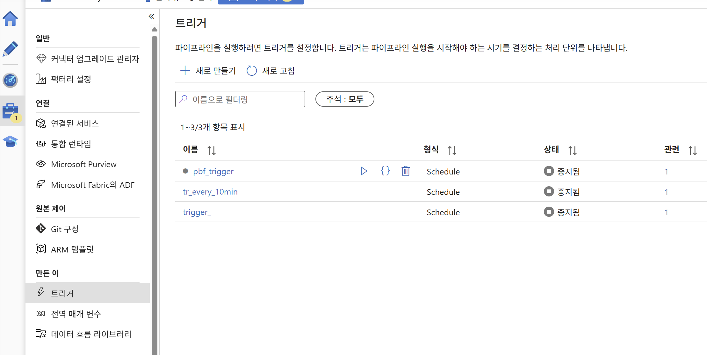

- `pbf_trigger` — OSM PBF 정기 수집
- `tr_every_10min` — 서울 API 실시간 데이터 10분 주기 수집

**수집 데이터 상세**

- **OSM (Geofabrik)**: 도로 중심선 및 보행로 네트워크 (PBF 포맷)
- **서울 열린데이터 광장 API**: 실시간 날씨·혼잡도·도로소통·이벤트 정보
- **S-DoT**: 산책로 인근 실시간 소음·진동 데이터
- **V-World** (로컬 수집): 토양 재질, 자갈 함량, 배수 등급 등 지형 특성 — 로컬에서 직접 다운로드 후 Blob Storage 업로드

### 2. 데이터 저장 (Azure Blob Storage)

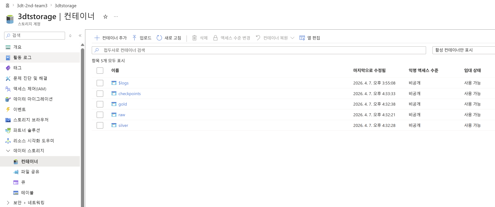

Azure Blob Storage를 Raw → Silver → Gold 계층으로 구성하여 데이터 품질을 단계적으로 관리합니다.

| 컨테이너 | 역할 |
|----------|------|
| `raw` | ADF가 수집한 원본 데이터 그대로 적재 |
| `silver` | Databricks에서 정제·변환된 중간 데이터 |
| `gold` | 공간 조인 완료, 지표 산출된 서빙용 최종 데이터 |

### 3. 데이터 처리 (Azure Databricks)

두 개의 독립적인 파이프라인을 운영합니다.

#### 지형 파이프라인 (edges)

OSM 도로 네트워크와 V-World 지형 데이터를 공간 조인하여 도로별 산책 지표를 산출합니다.  
Apache Sedona를 활용해 13만 개 이상의 도로 데이터에 대해 공간 조인(Spatial Join)을 수행합니다.

- **열 위험도**: 기온·복사열·토양 흡열 특성 기반
- **거칠기 점수**: 바닥 재질·자갈 함량 기반
- **쿠션 지수**: 토양 깊이·배수 등급 기반

실행 순서: `vworld_local.ipynb` → `bronze_raw.ipynb` → `silver_large_scale.ipynb` / `silver_small_scale.ipynb` → `gold_scored.ipynb`

#### 실시간 환경 파이프라인 (seoul_api)

서울 도시데이터 API와 S-DoT 센서 데이터를 수집해 장소별 실시간 보행 환경 지표를 만듭니다.

- **날씨**: 기온, 체감온도, 미세먼지, 자외선 등
- **혼잡도**: 실시간 유동인구 수준 및 혼잡 메시지
- **소음·진동**: S-DoT 센서 기반 구 단위 평균값

실행 순서: `storage_mount.ipynb` → `silver_citydata.ipynb` / `silver_sdot.ipynb` → `gold_sdot_join.ipynb`

---

## 🗄 데이터베이스 스키마

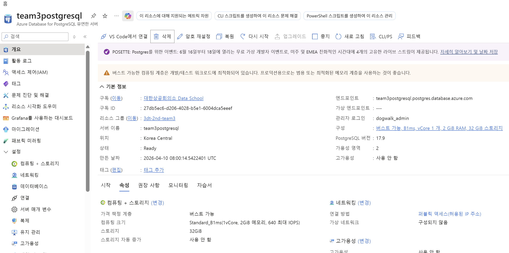

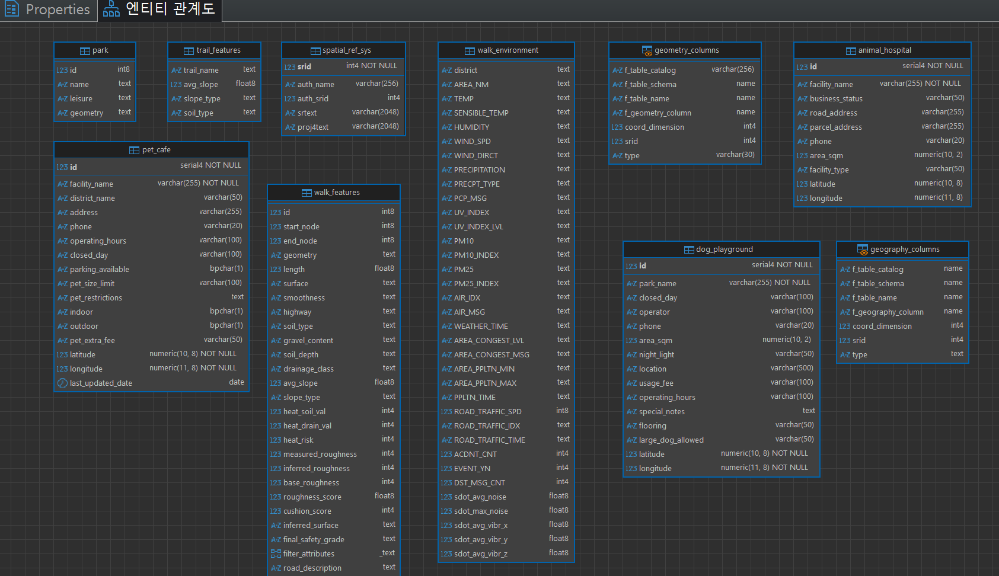

산책로 특성(`walk_features`)과 환경 정보(`walk_environment`)를 분리 설계하였으며, PostGIS를 활용해 `LINESTRING` 공간 데이터를 서울시 좌표계에 정확히 매핑했습니다.

| 테이블 | 역할 |
|--------|------|
| `walk_features` | 도로별 경사도·바닥 재질·열 위험도·거칠기·쿠션 점수 |
| `walk_environment` | 실시간 날씨·혼잡도·소음·진동·자외선·미세먼지 |
| `park` | 공원 정보 및 공간 좌표 |
| `trail_features` | 산책로 특성 (경사 등급·토양 재질) |
| `dog_playground` | 반려견 놀이터 정보 |
| `pet_cafe` | 반려견 동반 카페 정보 |
| `animal_hospital` | 동물병원 정보 |

---

## 🤖 경로 추천 시나리오

### LargeScale — 공원·산책로 추천 (`/api/trails`)

반려견 특성과 실시간 환경 데이터를 반영하여 주변 산책로·공원을 추천합니다.

- 사용자 위치 기반 반경 탐색 (최대 20km)
- 실시간 서울 도시데이터 API 연동 (기온·혼잡도·미세먼지 등)
- 경사도·바닥 재질·혼잡도·긴급재난문자 정보 포함
- 반려견 견종별 맞춤 안전 가이드 제공

### SmallScale — AI 루프 경로 추천 (`/api/routes`)

반려견 프로필을 분석해 출발점 주변 루프 경로를 AI로 추천합니다.

- 반려견 크기·나이·에너지·단두종·더위 민감 여부 등 프로필 반영
- 프로필 미입력 시 기본값 30분 기준으로 자동 조정
- GPT-4o-mini로 경로 추천 사유 자연어 설명 생성
- 계단·급경사·열 위험 구간 포함 경로 자동 필터링
- 조건 미충족 시 기본 경로 제공 + 미충족 사유 반환

---

## ☁️ Azure 리소스 구성

| 리소스 | 유형 | 위치 |
|--------|------|------|
| `3dt-3-dataFactory` | Azure Data Factory (V2) | Korea Central |
| `3dtstorage` | 스토리지 계정 | Korea Central |
| `pet_databricks` | Azure Databricks | Korea Central |
| `petWalkBackend` | Container Registry | Korea Central |
| `team3-openai` | Azure OpenAI | East US |
| `team3postgresql` | Azure Database for PostgreSQL | Korea Central |
| `pet-walk` | App Service | Korea Central |

### Azure OpenAI 모델 배포

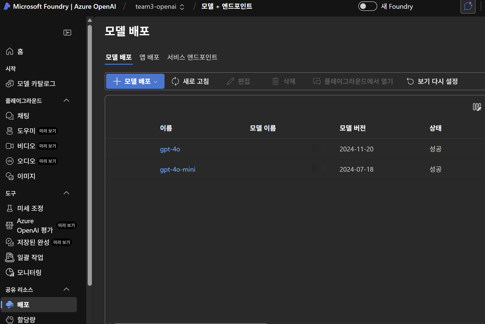

| 배포 이름 | 모델 | 버전 | 용도 |
|----------|------|------|------|
| `gpt-4o` | gpt-4o | 2024-11-20 | LargeScale 경로 추천 |
| `gpt-4o-mini` | gpt-4o-mini | 2024-07-18 | SmallScale 루프 경로 설명 |

### App Service 배포

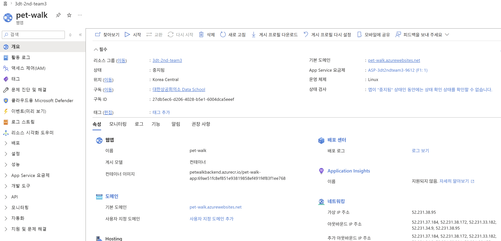

- URL: `pet-walk.azurewebsites.net`
- 게시 모델: **Docker 컨테이너** (`petwalkbackend.azurecr.io/pet-walk-app`)
- 런타임: Linux · App Service F1

### 환경 변수

```
AZURE_OPENAI_API_KEY / AZURE_OPENAI_API_VERSION
AZURE_OPENAI_DEPLOYMENT / AZURE_OPENAI_ENDPOINT / AZURE_OPENAI_MODEL_NAME
DATABASE_URL / DB_HOST / DB_NAME / DB_PASSWORD / DB_PORT / DB_USER
DISASTER_API_KEY / SEOUL_CITY_API_KEY
DOCKER_REGISTRY_SERVER_URL / DOCKER_REGISTRY_SERVER_USERNAME / DOCKER_REGISTRY_SERVER_PASSWORD
```

---

## 📱 앱 화면

### 1. 홈 — 주변 산책길


현재 위치 주변 산책로·공원을 지도에 표시하고, 날씨·미세먼지 정보를 상단에 표시합니다.

---

### 2. 날씨 정보

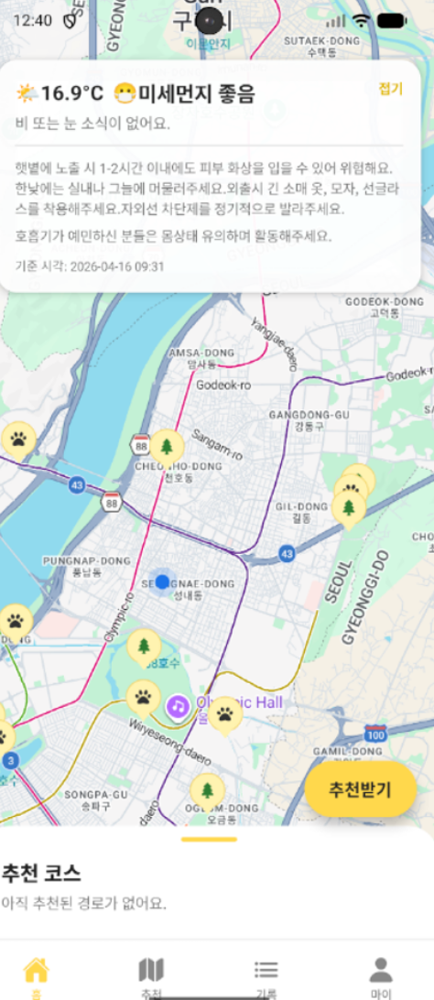

실시간 기온·미세먼지·자외선 지수와 반려견 산책 시 주의사항을 안내합니다.

---

### 3. 산책 추천 받기


출발 위치·산책 시간·혼잡도 선호·경사도 선호를 설정하고, 저장된 반려견 프로필을 자동 반영합니다.

---

### 4. 추천 경로

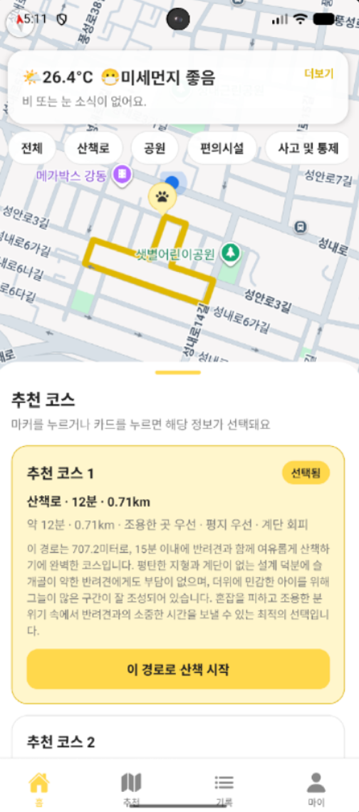

GPT-4o-mini가 생성한 맞춤 경로 설명과 함께 지도에 루프 경로를 표시합니다.

---

### 5. 산책 기록 · 내 강아지 정보

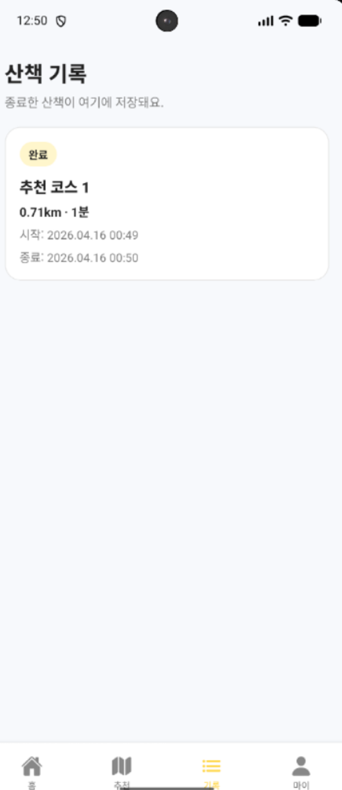


완료된 산책을 기록하고, 강아지 프로필(크기·나이·건강 특성)을 저장하면 추천에 자동 반영됩니다.

---

## 🌐 웹 대시보드

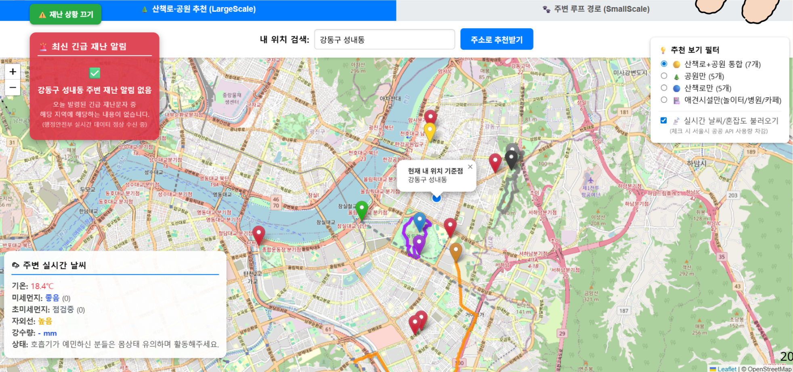

LargeScale / SmallScale 두 탭으로 구성된 웹 인터페이스입니다.

- **산책로·공원 추천 (LargeScale)**: 주소 검색, 실시간 날씨·혼잡도 확인, 긴급재난문자 표시
- **주변 루프 경로 (SmallScale)**: 반려견 프로필 기반 루프 경로 추천

---

## 🚀 배포 구성

비용 최적화를 위해 **수동 배포(Workflow Dispatch)** 방식을 채택했습니다.

```
Local Code
    ↓  git push
GitHub Repository
    ↓  Manual Trigger (Workflow Dispatch)
GitHub Actions
    ↓  Docker Build & Push
Azure Container Registry (petWalkBackend)
    ↓  Pull & Deploy
Azure App Service (pet-walk)
```

---

## 🛠 로컬 실행

```bash
git clone <repository_url>
cd SecondProjectTeam3

pip install -r requirements.txt
cd backend
uvicorn app.main:app --reload
# API 문서: http://127.0.0.1:8000/docs
```

### 환경 변수 (`.env`)

```env
DB_HOST=team3postgresql.postgres.database.azure.com
DB_NAME=<데이터베이스명>
DB_USER=dogwalk_admin
DB_PASSWORD=<비밀번호>
DB_PORT=5432

AZURE_OPENAI_ENDPOINT=https://team3-openai.openai.azure.com/
AZURE_OPENAI_API_KEY=<API 키>
AZURE_OPENAI_DEPLOYMENT=gpt-4o-mini
AZURE_OPENAI_MODEL_NAME=gpt-4o-mini
AZURE_OPENAI_API_VERSION=2024-12-01-preview

SEOUL_CITY_API_KEY=<서울 공공 API 키>
DISASTER_API_KEY=<긴급재난문자 API 키>
```

---

## 📂 폴더 구조

```
SecondProjectTeam3/
├── .github/workflows/    # CI/CD 워크플로 (Docker 빌드 & Azure 배포)
├── backend/
│   └── app/
│       ├── api/routes/
│       │   ├── large_scale/  # LargeScale 산책로·공원 추천
│       │   └── small_scale/  # SmallScale 루프 경로 추천
│       ├── core/             # 환경 설정
│       ├── models/           # Pydantic 데이터 모델
│       ├── services/         # 비즈니스 로직 (경사도 계산, 경로 탐색 등)
│       └── main.py
├── medallion/
│   ├── edges/                # 지형 파이프라인 (OSM + V-World)
│   └── seoul_api/            # 실시간 환경 파이프라인 (서울 API + S-DoT)
├── frontend/                 # React Native 모바일 앱
├── image/                    # README 이미지
├── docs/                     # 프로젝트 문서
├── Dockerfile
└── requirements.txt
```

---

## 🔗 관련 문서

| 문서 | 설명 |
|------|------|
| [데이터 정의서](./docs/data_dictionary.md) | 수집 및 가공 데이터의 컬럼/타입 정의 |
| [점수 산출 기준서](./docs/scoring_logic.md) | 열 위험도·거칠기·쿠션 점수 알고리즘 상세 |
| [백엔드 가이드](./docs/backend_guide.md) | 백엔드 구동 및 기능 안내 |
| [API 명세서](./docs/api_documentation.md) | API 엔드포인트 상세 명세 |
| [Azure 배포 가이드](./docs/azure_developer_guide.md) | Azure 배포, CI/CD 구성 및 과금 관리 |

---

## 📦 기술 스택


---

## 👤 담당 파트

OSM · V-World 데이터 수집 및 정제 (Azure Data Factory) ·  
지형 파이프라인 구축 (Apache Sedona 공간 조인 · Medallion 아키텍처 · Databricks)
