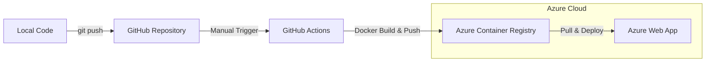

[🇰🇷 한국어](./README.md) | [🇺🇸 English](./README_EN.md)

# 🐾 Pet-Walk: Dog-Friendly Walk Route Risk Analysis & Recommendation System

A backend system that recommends optimal walking routes for pet owners by analyzing **terrain data (slope, surface material), real-time weather conditions, and nearby facility information** to ensure safe and comfortable walks.

---

## 🏗 System Architecture


| Layer | Service | Role |
|-------|---------|------|
| Data Ingestion | Azure Data Factory | Automated collection from OSM, Seoul API, S-DoT |
| Data Processing | Azure Databricks (Apache Sedona) | Spatial join & feature engineering |
| Data Storage | Azure Blob Storage (raw / silver / gold) | Layered data lake |
| Database | Azure Database for PostgreSQL (PostGIS) | Spatial data serving |
| Backend | FastAPI + Azure Web App | Containerized API server |
| AI | Azure OpenAI (GPT-4o / GPT-4o-mini) | Natural language route recommendations |

---

## 🛠 Data Pipeline

### 1. Data Ingestion (Azure Data Factory)

Automated collection from 3 public data sources via Azure Data Factory.


- **OSM (Geofabrik)**: Road centerlines and pedestrian network (PBF format, updated every 2 months)
- **Seoul Open Data API**: Real-time weather, congestion, road traffic, and event information
- **S-DoT**: Real-time noise and vibration data along walking routes
- **V-World** (local download): Soil material, gravel content, drainage grade and other terrain features — downloaded locally and uploaded to Blob Storage manually

### 2. Data Processing (Azure Databricks)

Two independent pipelines run on Azure Databricks.

#### 📍 Terrain Pipeline (edges)

Performs spatial joins between OSM road network and V-World terrain data to compute per-road walking metrics. Apache Sedona is used to process 130,000+ road segments.

- **Heat Risk**: Based on surface temperature, solar absorption, and soil thermal properties
- **Roughness Score**: Based on surface material and gravel content
- **Cushion Index**: Based on soil depth and drainage grade

Execution order: `vworld_local.ipynb` → `bronze_raw.ipynb` → `silver_large_scale.ipynb` / `silver_small_scale.ipynb` → `gold__scored.ipynb`

`%restart_python` is required after Sedona installs. See [Medallion Pipeline Guide](./medallion/README.md) for details.

#### 🌤 Real-time Environment Pipeline (seoul_api)

Collects Seoul city data API and S-DoT sensor data to build real-time walking environment metrics per location. Joins weather, congestion, road traffic, and event data on AREA_NM, then attaches S-DoT noise/vibration aggregated at the district level.

- **Weather**: Temperature, sensible temperature, fine dust, UV index, etc.
- **Congestion**: Real-time population level and congestion message
- **Road Traffic**: Average speed and congestion index per area
- **Noise & Vibration**: District-level averages from S-DoT sensors

Execution order: `storage_mount.ipynb` → `silver_citydata.ipynb` / `silver_sdot.ipynb` → `gold_sdot_join.ipynb`

### 3. Data Storage (Layered Data Lake)

Azure Blob Storage structured in Raw → Silver → Gold layers for progressive data quality management.

### 4. Database Design (PostgreSQL + PostGIS)


Designed with scalability in mind by separating trail characteristics (`walk_features`) from environmental data (`walk_environment`). Processed `LINESTRING` geometries are accurately mapped to Seoul's coordinate system via PostGIS.

---

## 🚀 Backend Service

### Deployment Flow



Manual deployment (Workflow Dispatch) adopted for cost optimization.

### Project Structure

```text
SecondProjectTeam3/
├── .github/workflows/    # CI/CD workflow (Azure deployment)
├── backend/
│   └── app/
│       ├── api/          # API endpoints (recommendations, map, safety info)
│       ├── core/         # Configuration
│       ├── models/       # Pydantic data models
│       ├── services/     # Business logic (slope calculation, route search, etc.)
│       └── main.py
├── medallion/
│   ├── edges/            # Terrain pipeline (OSM + V-World)
│   │   ├── vworld_local.ipynb       # V-World SHP local download & district filtering
│   │   ├── bronze_raw.ipynb
│   │   ├── silver_large_scale.ipynb
│   │   ├── silver_small_scale.ipynb
│   │   └── gold__scored.ipynb
│   ├── seoul_api/        # Real-time environment pipeline (Seoul API + S-DoT)
│   │   ├── storage_mount.ipynb
│   │   ├── silver_citydata.ipynb
│   │   ├── silver_sdot.ipynb
│   │   └── gold_sdot_join.ipynb
│   └── postgres/         # PostgreSQL ingestion
│       └── postgres_load_realtime.ipynb
├── data/                 # Spatial datasets (SHP, GPX, GeoJSON)
├── frontend/             # React Native mobile app
├── image/                # README assets
├── docs/                 # Project documentation
├── Dockerfile
└── requirements.txt
```

### Local Setup

```bash
pip install -r requirements.txt
cd backend
uvicorn app.main:app --reload
# API docs: http://127.0.0.1:8000/docs
```

---

## 🔗 Documentation

| Document | Description |
|----------|-------------|
| [Data Dictionary](./docs/data_dictionary.md) | Column/type definitions for collected and processed data |
| [Scoring Logic](./docs/scoring_logic.md) | Detailed algorithm for heat risk, roughness, and cushion scores |
| [Backend Guide](./docs/backend_guide.md) | Backend setup and feature guide |
| [Frontend Guide](./docs/frontend_guide.md) | Frontend setup and screen guide |
| [API Documentation](./docs/api_documentation.md) | API endpoint specifications |
| [Azure Deployment Guide](./docs/azure_developer_guide.md) | Azure deployment, CI/CD setup, and cost management |
| [Small Scale Dev Guide](./docs/small_scale_dev_guide.md) | Folder structure and import path guide for loop route features |

---

## 📦 Tech Stack


