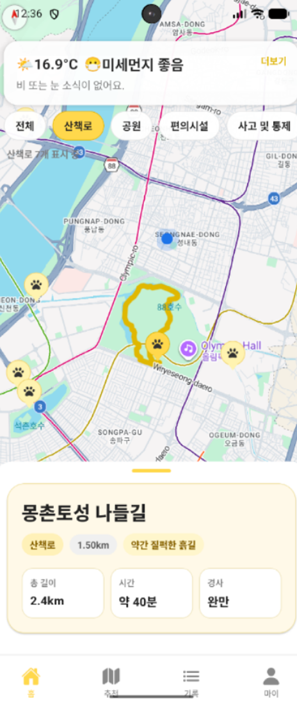

[🇰🇷 한국어](./README_KO.md) | [🇺🇸 English](./README_EN.md)

# 🐾 Pet-Walk: Pet Trail Risk Analysis and Route Recommendation System

A Azure-based terrain data pipeline that automatically collects public data (OSM · V-World · Seoul API · S-DoT) via Azure Data Factory and processes 130,000+ spatial joins using Apache Sedona on Databricks.

---

## 📌 Project Overview

**Pet-Walk** is a backend system that recommends optimal walking routes for pets by comprehensively analyzing terrain information (slope · surface material), real-time weather data, and nearby facility information.

Two recommendation scenarios are supported:

- **LargeScale**: Long-distance route search focused on large parks — recommends trails and parks reflecting dog characteristics and real-time environmental data
- **SmallScale**: AI-powered loop route recommendation based on dog profile (size · age · health conditions) — GPT-4o-mini generates personalized route explanations

| Item | Details |
|------|---------|
| Backend | FastAPI + Azure App Service (Docker container deployment) |
| Data Pipeline | Azure Data Factory → Azure Blob Storage (Medallion) → Azure Databricks |
| Database | Azure Database for PostgreSQL + PostGIS |
| AI | Azure OpenAI (GPT-4o · GPT-4o-mini) |
| Client | React Native mobile app · Web dashboard |

---

## 🏗 System Architecture


| Layer | Service | Role |
|-------|---------|------|
| Data Collection | Azure Data Factory | Auto-collect OSM · S-DoT · Seoul API |
| Intermediate Storage | Azure Blob Storage (raw / silver / gold) | Medallion data lake |
| Data Processing | Azure Databricks (Apache Sedona) | Spatial join and metric calculation |
| Database | Azure Database for PostgreSQL + PostGIS | Spatial data storage and serving |
| Backend | FastAPI + Azure App Service | API server (Docker container) |
| AI | Azure OpenAI (GPT-4o · GPT-4o-mini) | Natural language route recommendation |

---

## 🛠 Data Pipeline

### 1. Data Collection (Azure Data Factory)

**Pipeline Configuration**


- `Pipeline_Ingest_OSM_PBF` — Collects OSM PBF files from Geofabrik → Blob Storage
- `pl_sdot_sensor` — Collects S-DoT sensor data
- `seoul_api_to_raw` — Collects Seoul Open Data Plaza API data

**Linked Services**


- `ADLS_blob_storage` — Azure Data Lake Storage Gen2
- `Geofabrik` — OSM PBF HTTP source
- `ls_blob_storage` — Azure Blob Storage
- `seoul_api` — Seoul public API HTTP source

**Triggers**


- `pbf_trigger` — Scheduled OSM PBF collection
- `tr_every_10min` — Seoul API real-time data every 10 minutes

**Data Sources**

- **OSM (Geofabrik)**: Road centerlines and pedestrian network (PBF format)
- **Seoul Open Data API**: Real-time weather · congestion · traffic · event data
- **S-DoT**: Real-time noise and vibration data near walking paths
- **V-World** (local): Soil type, gravel content, drainage grade — downloaded locally and uploaded to Blob Storage

### 2. Data Storage (Azure Blob Storage)


Azure Blob Storage is structured in Raw → Silver → Gold layers for progressive data quality management.

| Container | Role |
|-----------|------|
| `raw` | Original data as collected by ADF |
| `silver` | Cleansed and transformed intermediate data from Databricks |
| `gold` | Final serving data with spatial joins and metrics calculated |

### 3. Data Processing (Azure Databricks)

Two independent pipelines are operated.

#### Terrain Pipeline (edges)

Performs spatial joins between OSM road network and V-World terrain data to calculate per-road walking metrics.  
Apache Sedona handles spatial joins across 130,000+ road records.

- **Heat risk**: Based on temperature · solar radiation · soil heat absorption
- **Roughness score**: Based on surface material · gravel content
- **Cushion index**: Based on soil depth · drainage grade

Execution order: `vworld_local.ipynb` → `bronze_raw.ipynb` → `silver_large_scale.ipynb` / `silver_small_scale.ipynb` → `gold_scored.ipynb`

#### Real-time Environment Pipeline (seoul_api)

Collects Seoul urban data API and S-DoT sensor data to build real-time walkability indicators per location.

- **Weather**: Temperature, feels-like, fine dust, UV index, etc.
- **Congestion**: Real-time foot traffic level and congestion message
- **Noise/Vibration**: S-DoT sensor district-level averages

Execution order: `storage_mount.ipynb` → `silver_citydata.ipynb` / `silver_sdot.ipynb` → `gold_sdot_join.ipynb`

---

## 🗄 Database Schema


Trail characteristics (`walk_features`) and environmental data (`walk_environment`) are designed separately, with PostGIS mapping `LINESTRING` spatial data to the Seoul coordinate system.

| Table | Role |
|-------|------|
| `walk_features` | Per-road slope · surface material · heat risk · roughness · cushion score |
| `walk_environment` | Real-time weather · congestion · noise · vibration · UV · fine dust |
| `park` | Park information and spatial coordinates |
| `trail_features` | Trail characteristics (slope grade · soil type) |
| `dog_playground` | Dog playground information |
| `pet_cafe` | Pet-friendly cafe information |
| `animal_hospital` | Veterinary hospital information |

---

## 🤖 Route Recommendation Scenarios

### LargeScale — Trail & Park Recommendation (`/api/trails`)

Recommends nearby trails and parks based on dog characteristics and real-time environmental data.

- Radius-based search from user location (up to 20km)
- Real-time Seoul urban data API integration (temperature · congestion · fine dust)
- Includes slope · surface material · congestion · disaster alert information
- Breed-specific safety guide per dog profile

### SmallScale — AI Loop Route Recommendation (`/api/routes`)

Recommends loop routes near the starting point based on dog profile analysis.

- Reflects dog size · age · energy · brachycephalic · heat sensitivity
- Auto-adjusts to default 30 minutes when profile is not provided
- GPT-4o-mini generates natural language explanation for recommended routes
- Auto-filters routes with stairs · steep slopes · heat-risk sections
- Returns default route + unmet condition reasons when no match found

---

## ☁️ Azure Resources

| Resource | Type | Region |
|----------|------|--------|
| `3dt-3-dataFactory` | Azure Data Factory (V2) | Korea Central |
| `3dtstorage` | Storage Account | Korea Central |
| `pet_databricks` | Azure Databricks | Korea Central |
| `petWalkBackend` | Container Registry | Korea Central |
| `team3-openai` | Azure OpenAI | East US |
| `team3postgresql` | Azure Database for PostgreSQL | Korea Central |
| `pet-walk` | App Service | Korea Central |

### Azure OpenAI Model Deployments


| Deployment | Model | Version | Usage |
|-----------|-------|---------|-------|
| `gpt-4o` | gpt-4o | 2024-11-20 | LargeScale route recommendation |
| `gpt-4o-mini` | gpt-4o-mini | 2024-07-18 | SmallScale loop route explanation |

### App Service Deployment


- URL: `pet-walk.azurewebsites.net`
- Publish model: **Docker container** (`petwalkbackend.azurecr.io/pet-walk-app`)
- Runtime: Linux · App Service F1

### Environment Variables

```
AZURE_OPENAI_API_KEY / AZURE_OPENAI_API_VERSION
AZURE_OPENAI_DEPLOYMENT / AZURE_OPENAI_ENDPOINT / AZURE_OPENAI_MODEL_NAME
DATABASE_URL / DB_HOST / DB_NAME / DB_PASSWORD / DB_PORT / DB_USER
DISASTER_API_KEY / SEOUL_CITY_API_KEY
DOCKER_REGISTRY_SERVER_URL / DOCKER_REGISTRY_SERVER_USERNAME / DOCKER_REGISTRY_SERVER_PASSWORD
```

---

## 📱 App Screens

### 1. Home — Nearby Trails



Displays nearby trails and parks on the map with real-time weather and fine dust information.

---

### 2. Weather Information


Provides real-time temperature · fine dust · UV index and pet walking safety tips.

---

### 3. Get Route Recommendation


Set departure location · walking time · congestion preference · slope preference, with saved dog profile automatically applied.

---

### 4. Recommended Route


Displays the loop route on the map along with GPT-4o-mini generated personalized route description.

---

### 5. Walk History · Dog Profile


Records completed walks, and saved dog profile (size · age · health conditions) is automatically reflected in recommendations.

---

## 🌐 Web Dashboard


A web interface with two tabs for LargeScale and SmallScale scenarios.

- **Trail & Park Recommendation (LargeScale)**: Address search, real-time weather/congestion, disaster alerts
- **Loop Route (SmallScale)**: Dog profile-based loop route recommendation

---

## 🚀 Deployment

Manual deployment (Workflow Dispatch) was adopted for cost optimization.

```
Local Code
    ↓  git push
GitHub Repository
    ↓  Manual Trigger (Workflow Dispatch)
GitHub Actions
    ↓  Docker Build & Push
Azure Container Registry (petWalkBackend)
    ↓  Pull & Deploy
Azure App Service (pet-walk)
```

---

## 🛠 Local Development

```bash
git clone <repository_url>
cd SecondProjectTeam3

pip install -r requirements.txt
cd backend
uvicorn app.main:app --reload
# API docs: http://127.0.0.1:8000/docs
```

### Environment Variables (`.env`)

```env
DB_HOST=team3postgresql.postgres.database.azure.com
DB_NAME=<database_name>
DB_USER=dogwalk_admin
DB_PASSWORD=<password>
DB_PORT=5432

AZURE_OPENAI_ENDPOINT=https://team3-openai.openai.azure.com/
AZURE_OPENAI_API_KEY=<api_key>
AZURE_OPENAI_DEPLOYMENT=gpt-4o-mini
AZURE_OPENAI_MODEL_NAME=gpt-4o-mini
AZURE_OPENAI_API_VERSION=2024-12-01-preview

SEOUL_CITY_API_KEY=<Seoul public API key>
DISASTER_API_KEY=<disaster alert API key>
```

---

## 📂 Project Structure

```
SecondProjectTeam3/
├── .github/workflows/    # CI/CD workflow (Docker build & Azure deploy)
├── backend/
│   └── app/
│       ├── api/routes/
│       │   ├── large_scale/  # LargeScale trail & park recommendation
│       │   └── small_scale/  # SmallScale loop route recommendation
│       ├── core/             # Environment configuration
│       ├── models/           # Pydantic data models
│       ├── services/         # Business logic (slope calculation, route search)
│       └── main.py
├── medallion/
│   ├── edges/                # Terrain pipeline (OSM + V-World)
│   └── seoul_api/            # Real-time environment pipeline (Seoul API + S-DoT)
├── frontend/                 # React Native mobile app
├── image/                    # README images
├── docs/                     # Project documentation
├── Dockerfile
└── requirements.txt
```

---

## 🔗 Documentation

| Document | Description |
|----------|-------------|
| [Data Dictionary](./docs/data_dictionary.md) | Column/type definitions for collected and processed data |
| [Scoring Logic](./docs/scoring_logic.md) | Heat risk · roughness · cushion score algorithm details |
| [Backend Guide](./docs/backend_guide.md) | Backend setup and feature guide |
| [API Documentation](./docs/api_documentation.md) | Detailed API endpoint specifications |
| [Azure Deployment Guide](./docs/azure_developer_guide.md) | Azure deployment, CI/CD, and cost management |

---

## 📦 Tech Stack


---

## 👤 My Contribution

OSM · V-World data collection and preprocessing (Azure Data Factory) ·  
Terrain pipeline development (Apache Sedona spatial join · Medallion architecture · Databricks)
